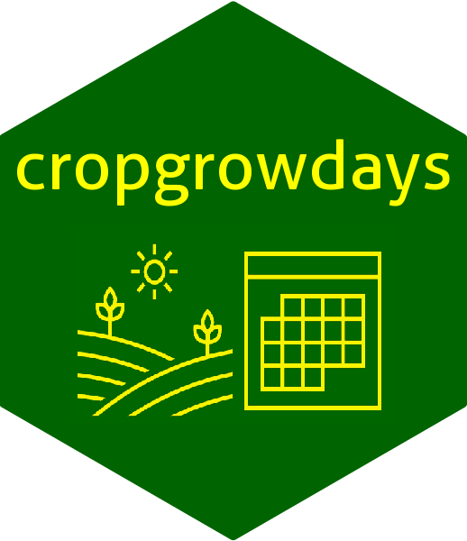

<!-- README.md is generated from README.Rmd. Please edit that file -->
<!-- process header/icon differently for latex and html -->
<!--  the header with latex version only BUT THIS DOESN'T WORK! somewhat hard to debug -->
# cropgrowdays 

Version: 0.2.1

<!-- Common intro material -->

## Quick Start

Install the latest stable version of **cropgrowdays** via CRAN with:

``` r
install.packages("cropgrowdays")
```

You can install the development version of **cropgrowdays** from
`GitLab` with:

``` r
## if you don't have 'remotes' installed, automatically install it
if (!require("remotes")) {
  install.packages("remotes", repos = "http://cran.rstudio.com/")
  library("remotes")
}
install_gitlab("petebaker/cropgrowdays", build_vignettes = TRUE)
```

## Overview

The **cropgrowdays** package provides functions to calculate
agrometeorological quantities of interest for modelling crop data.
Currently, functions are provided for calculating growing degree days,
stress days, cumulative and daily means of weather data. Australian
meteorological data can be obtained from Queensland Government’s
Department of Environment and Science (DES) website. In addition,
functions are provided to convert days of the year to dates, and
*vice-versa*.

We recommend using the **cropgrowdays** package in conjunction with the
**tidyverse** and **lubridate** packages. Additionally, we also
recommend using the **furrr** package to speed up adding
agrometeorological variables to large data frames. For this document, we
only use the **lubridate** package as follows.

``` r
suppressMessages(library(lubridate))
library(cropgrowdays)
```

Note that if you are not familiar with the `lubridate` package, then in
order to see which functions are provided and which functions conflict
with other packages, initially it may best not to suppress messages
using `suppressMessages`.

## Usage

There are currently four key agrometeorological calculation functions in
**cropgrowdays**. These are:

- `cumulative` calculates cumulative weather data between between two
  dates, and
- `daily_mean` calculates daily mean of a weather variable between two
  dates, and
- `growing_degree_days` calculates the growing degree days between two
  dates as the sum of the difference between daily average temp and a
  baseline value where the daily average temp is capped, and
- `stress_days_over` calculates the number of days that the maximum
  temperature is over a baseline value between between two dates.

In addition, several functions are available to calculate the day of
year or convert this to a date, namely:

- `day_of_year` calculates day of year from a date, and
- `date_from_day_year` calculates a date from the day of the year and
  the year, and
- `day_of_harvest` returns day of harvest in the year of sowing which,
  of course, may be a different year to the year of harvest.

Currently, two functions are available to retrieve SILO weather data
from Queensland Government DES longpaddock website.

- `get_silodata` retrieves weather data for one location from the
  `longpaddock` website, and
- `get_multi_silodata` retrieves weather data for several locations from
  the `longpaddock` website.

SILO (Scientific Information for Land Owners) is a database of
Australian climate data hosted by the Science and Technology Division of
the Queensland Government’s Department of Environment and Science (DES).
SILO datasets are constructed from Australian Bureau of Meteorology
observations and may change due to data correction or improved
interpolation or imputation.

## Agrometeorological calculations

The `boonah` dataset contains meteorological SILO data for the period 1
Jan 2019 to 31 May 2020 obtained from the Longpaddock Queensland
Government DES web site <https://www.longpaddock.qld.gov.au> for Boonah
which is located at -27.9927 S, 152.6906 E. The data is in `APSIM`
format and contains temperature, rainfall, evaporation and radiation
variables and the rows are consecutive days during the period. The
weather data set was obtained using

``` r
boonah <-
   get_silodata(latitude = "-27.9927", longitude = "152.6906",
                email = "MY_EMAIL_ADDRESS", START = "20190101", FINISH = "20200531")
```

To obtain gridded data, which is what `get_silodata` assumes, you need
to supply at least the site latitude and longitude as well as your email
address by replacing `MY_EMAIL_ADDRESS` with your email address. The
data is freely available under the Creative Commons 4.0 License. Note
that SILO may be unavailable between 11am and 1pm (Brisbane time) each
Wednesday and Thursday to allow for essential system maintenance. Also
please note that, by default, `apsim` data are retrieved. Most, but not
all, of the other formats are also available. See the help for
`get_silodata` for details. You can obtain this help using
`?cropgrowdays::get_silodata` at the R Console prompt or using your
favourite help system.

The data obtained is

``` r
## weather data object
print(boonah, n=5)
#: # A tibble: 517 × 10
#:    year   day  radn  maxt  mint  rain  evap    vp   code date_met  
#:   <int> <int> <dbl> <dbl> <dbl> <dbl> <dbl> <dbl>  <int> <date>    
#: 1  2019     1  26.2  33.9  16.3     0   7.8  20.6 222222 2019-01-01
#: 2  2019     2  28.2  33.4  17.6     0   7.7  19.8 222222 2019-01-02
#: 3  2019     3  20.5  32.8  16.7     0   6.8  21.9 222222 2019-01-03
#: 4  2019     4  23    32.5  21       2   7.7  22   222222 2019-01-04
#: 5  2019     5  27    33.6  16.8     0   6    21.8 222222 2019-01-05
#: # ℹ 512 more rows
```

The `crop` dataset consists of dates for a hypothetical crop data set
which would also usually contain agronomic traits of interest such as
yield, dry matter yield and so on. Each row of data contains sowing,
flowering and harvest dates for a typical field or farm in Queensland,
Australia.

``` r
## crop data object
print(crop, n=5)
#: # A tibble: 10 × 3
#:   sowing_date flower_date harvest_date
#:   <date>      <date>      <date>      
#: 1 2019-08-25  2019-10-14  2019-11-03  
#: 2 2019-09-20  2019-11-09  2019-11-29  
#: 3 2019-12-18  2020-02-06  2020-02-26  
#: 4 2020-01-15  2020-03-06  2020-03-26  
#: 5 2020-02-15  2020-04-06  2020-04-26  
#: # ℹ 5 more rows
```

Example `R` syntax is provided for calculating daily mean radiation,
total rainfall, growing degree dates and the number of stress days
between two dates. Alternatively, a number of days before or after a
certain date may be specified.

Note that employing mapping functions to add agrometeorological
variables to large data frames can take a substantial amount of
computational time. We describe how to employ the `furrr` package, which
provides a relatively simple way to apply mapping functions in parallel,
to speed up these calculations.

### Growing Degree Days

The `growing_degree_days` function calculates the sum of degree days for
each day $i = 1 \ldots n$. The growing degree days $GDD$ summed over $n$
days are

$$GDD = \sum_i^n (Tmax_{i} + Tmin_{i}) / 2 - T_{base}$$

during specified dates for a tibble/data frame of daily weather data.
For each day $i$, the maximum temperature is $Tmax_{i}$ and minimum is
$Tmin_{i}$. Note that the maximum temperature $Tmax$ is capped at
`maxt_cap` degrees when calculating average temperature. The defaults
are $T_{base} = 5^{\circ}C$ and $Tmax$ is capped at
$Tmax_{cap} = 30^{\circ}C$. (See McMaster and Wilhelm (1997) or
<https://farmwest.com/climate/calculator-information/gdd/> (Anon 2021))

The *gdd* functions in the *pollen* package (Nowosad 2019) and in
*agroclim* (Serrano-Notivoli 2020) also calculate growing degree days.
While these functions do not allow for a fixed number of days, and in
the case of *agroclim::gdd* assume a more limited growing season since
the function appears to be tailored to grapes, further variations on the
formula above as outlined in Baskerville and Emin (1969) are available.

To calculate the growing degree days at Boonah using weather data from
the `boonah` object between flowering and harvest use:

``` r
## Growing Degree Days between two dates
crop$flower_date[4]     # flowering date for 4th field or farm in 'crop'
#: [1] "2020-03-06"
crop$harvest_date[4]    # harvest date for 4th field or farm in 'crop'
#: [1] "2020-03-26"
growing_degree_days(boonah, startdate = crop$flower_date[4],
                         enddate = crop$harvest_date[4]) #, monitor = TRUE)
#: [1] 359.05
```

### Stress days

`stress_days_over` calculates the number of days when the maximum
temperature exceeded a base line `stress_temp` during specified dates
for a tibble/data frame of daily weather data. The default `stress_temp`
is set at $30^{\circ}C$.

To calculate the number of stress days at Boonah between flowering and
harvest, use:

``` r
## Stress days  between two dates
stress_days_over(boonah, startdate = crop$flower_date[4],
                 enddate = crop$harvest_date[4]) # , monitor = TRUE)
#: [1] 4
```

### Cumulative calculations

`cumulative` calculates the sum total of daily values between two dates
from a tibble/data frame of daily weather data. Typically this is used
for solar radiation or rainfall.

To calculate the total rainfall at Boonah between flowering and harvest,
use:

``` r
## cumulative rainfall between two dates (flowering and harvest)
cumulative(boonah, var = rain, startdate = crop$flower_date[4],
           enddate = crop$harvest_date[4])
#: [1] 22.8
```

### Daily means

`daily_mean` calculates the daily average of a variable between two
dates from a tibble/data frame of daily weather data. Typically this
would be for temperature, rainfall or solar radiation.

To calculate daily mean radiation in the 3 day period from day of
flowering onwards (which also includes day of flowering), use:

``` r
## daily mean radiation for the three days ending on crop$flower_date[4]
crop$flower_date[4] # a particular flowering date
#: [1] "2020-03-06"
daily_mean(boonah, enddate = crop$flower_date[4], ndays = 3,
           monitor = TRUE)
#: # A tibble: 3 × 2
#:   date_met    radn
#:   <date>     <dbl>
#: 1 2020-03-04  10.7
#: 2 2020-03-05  11.8
#: 3 2020-03-06  11
#: [1] 11.16667
```

## Extracting weather data from a tibble or dataframe

To extract column(s) from a tibble/data frame of daily weather data
between two specified dates we use `weather_extract`. Either specify the
start and end dates or specify one of these dates and also the number of
days after or before, respectively.

``` r
## Extract daily rainfall & maximum temperature data using %>% pipe operator
boonah |>
  weather_extract(c(rain, maxt), date = date_met, startdate = ymd("2019-08-16"),
                  enddate = ymd("2019-08-21"))
#: # A tibble: 6 × 3
#:   date_met    rain  maxt
#:   <date>     <dbl> <dbl>
#: 1 2019-08-16     0  26  
#: 2 2019-08-17     0  28  
#: 3 2019-08-18     0  25.7
#: 4 2019-08-19     0  26.8
#: 5 2019-08-20     0  23.1
#: 6 2019-08-21     0  26.3
```

## Adding agrometeorological variables to dataframes

We can add agrometeorological variables to the `crop` tibble using the
`tidyverse` functions `map_dbl`, `map_dbl2` and `pmap` to calculate new
columns employing the weather data from the `boonah` object. Use
`map_dbl` for one varying date and `map_dbl2` for varying start and end
dates. For more than two varying parameters, which may be necessary if
for instance our weather object contained multiple locations or sites,
then we can use `pmap`. These functions are from the `purrr` library.
Alternatively, we could use functions from the `apply` family such as
`mapply` from the `base` package.

To add growing degree days 7 days post sowing and the number of stress
days above $30^\circ C$ from flowering to harvest to the `crop` tibble,
then we employ the following `mutate` syntax to extract the appropriate
weather data from the `boonah` weather data object.

``` r
## Growing degree and stress days
crop2 <- crop |>
  dplyr::mutate(gddays_post_sow_7d =
           purrr::map_dbl(sowing_date, function(x)
             growing_degree_days(boonah, startdate = x, ndays = 7)),
         stressdays_flower_harvest =
           purrr::map2_dbl(flower_date, harvest_date, function(x, y)
             stress_days_over(boonah, startdate = x, enddate = y)))
print(crop2, n=5)
#: # A tibble: 10 × 5
#:   sowing_date flower_date harvest_date gddays_post_sow_7d stressdays_flower_ha…¹
#:   <date>      <date>      <date>                    <dbl>                  <dbl>
#: 1 2019-08-25  2019-10-14  2019-11-03                 76.4                     10
#: 2 2019-09-20  2019-11-09  2019-11-29                104.                      20
#: 3 2019-12-18  2020-02-06  2020-02-26                132.                      11
#: 4 2020-01-15  2020-03-06  2020-03-26                142.                       4
#: 5 2020-02-15  2020-04-06  2020-04-26                145.                       5
#: # ℹ 5 more rows
#: # ℹ abbreviated name: ¹​stressdays_flower_harvest
```

Similarly, to add total rainfall for the 7 days post sowing and the mean
daily radiation from flowering to harvest we use:

``` r
## Totals and daily means
crop3 <- crop |>
  dplyr::mutate(totalrain_post_sow_7d =
           purrr::map_dbl(sowing_date, function(x)
             cumulative(boonah, var = rain, startdate = x, ndays = 7)),
         meanrad_flower_harvest =
           purrr::map2_dbl(flower_date, harvest_date, function(x, y)
             daily_mean(boonah, var = radn, startdate = x, enddate = y)))
print(crop3, n=5)
#: # A tibble: 10 × 5
#:   sowing_date flower_date harvest_date totalrain_post_sow_7d
#:   <date>      <date>      <date>                       <dbl>
#: 1 2019-08-25  2019-10-14  2019-11-03                    10.5
#: 2 2019-09-20  2019-11-09  2019-11-29                     0  
#: 3 2019-12-18  2020-02-06  2020-02-26                     0  
#: 4 2020-01-15  2020-03-06  2020-03-26                    88.4
#: 5 2020-02-15  2020-04-06  2020-04-26                    20.7
#: # ℹ 5 more rows
#: # ℹ 1 more variable: meanrad_flower_harvest <dbl>
```

### Speeding up calculations using `furrr`

For large datasets these calculations can be time consuming. One
approach that may prove useful is to use the `furrr` package which is a
bridge between purrr‘s family of mapping functions and future‘s parallel
processing capabilities. If speed is an issue, then it is worth trying
because it is simple to implement. While some tweaking may prove useful,
it seems that the defaults work pretty well (see `?future::plan`). After
setting the number of workers, then simply replace mapping functions by
putting `future_` at the front of the name of the mapping function. For
instance, `map2_dbl` is replaced with `future_map2_dbl`. While the
results are not shown here, to add total rain and mean radiation as
before, use something like:

``` r
ptm <- proc.time() # Start the clock!
## set number of 'furrr' workers
library(furrr)
plan(multisession, workers = 2)
## Totals and daily means
crop3 <- crop |>
  dplyr::mutate(totalrain_post_sow_7d =
           future_map_dbl(sowing_date, function(x)
             cumulative(boonah, var = rain, startdate = x, ndays = 7)),
         meanrad_flower_harvest =
           future_map2_dbl(flower_date, harvest_date, function(x, y)
             daily_mean(boonah, var = radn, startdate = x, enddate = y)))
print(crop3, n=5)
proc.time() - ptm # Stop the clock!
```

For recent work, we have found that setting 4 workers was optimal but
this will of course depend on your setup.

## Day of year calculations

When modelling crops, agronomists typically specify dates as the day of
year. Several functions are available for day of year calculations and
converting these back to dates. In `R`, dates, times and timezone data
are easily manipulated using the `lubridate` package.

The `day_of_year` function is used to convert a date to the day of year,
which could be based on the calendar year starting on 1 January, the
Australian financial year starting on 1 July or an arbitrary starting
date.

``` r
##  Day of Calendar Year
day_of_year(ymd(c("2020-12-31", "2020-07-01", "2020-01-01")))
#: [1] 366 183   1
day_of_year(ymd(c("2020-12-31", "2020-07-01", "2020-01-01")), return_year = TRUE)
#:   day year
#: 1 366 2020
#: 2 183 2020
#: 3   1 2020

## Day of Financial Year
day_of_year(ymd(c("2020-12-31", "2020-07-01", "2020-01-01")), type = "financial")
#: [1] 184   1 185
day_of_year(ymd(c("2020-12-31", "2020-07-01", "2020-01-01")), type = "fin",
            return_year = TRUE)
#:   day  fin_year
#: 1 184 2020/2021
#: 2   1 2020/2021
#: 3 185 2019/2020
```

To convert a day of year to a date, use `date_from_day_year` noting that
while the calendar year is the default, we can specify the Australian
financial year or an arbitrary starting date.

``` r
## Convert day of year to a date
date_from_day_year(21,2021)
#: [1] "2021-01-21"
date_from_day_year(21,2021, type = "fina")
#: [1] "2021-07-21"
```

Finally, while we can use `day_of_year` to obtain the day of the current
year, if a crop is planted near the end of the year then we way wish to
know the day of harvest which will fall in the next year. The
`day_of_harvest` function provides the day of year in the year of sowing
which can be used to calculate other quantities like day of flowering
etc. Thus, quantities like the number of days between harvest and sowing
are easily calculated taking into account that the crop may grow past
the end of the year. Alternatively, these quantities are also easily
computed directly on the dates by using the `lubridate` package. For
instance the convenience function `cropgrowdays::number_of_days` is
essentially a call to `as.numeric(finish_date - start_date) + 1`.

``` r
## Day of harvest using the first day of the year of sowing as the base day
day_of_year(ymd("2021-01-05"))
#: [1] 5
day_of_harvest(x = ymd("2021-01-05"), sowing = ymd("2020-12-20"))  # > 366
#: [1] 371
```

Note that the first calculation simply assumes the first day of the year
is 1 January 2021 whereas the second calculation yields a result
assuming the first day of the year is 1 January 2020. Hence, since 2020
is a leap year containing 366 days, then the day of harvest is
$366 + 5 = 371$.

## References

<div id="refs" class="references csl-bib-body hanging-indent">

<div id="ref-anonGDD" class="csl-entry">

Anon. 2021. “GDD.” *Farmwest*.
<https://farmwest.com/climate/calculator-information/gdd/>.

</div>

<div id="ref-baskerville1969" class="csl-entry">

Baskerville, G. L., and P. Emin. 1969. “Rapid Estimation of Heat
Accumulation from Maximum and Minimum Temperatures.” *Ecology* 50 (3):
514–17. <https://doi.org/10.2307/1933912>.

</div>

<div id="ref-mcmaster1997" class="csl-entry">

McMaster, Gregory S, and W W Wilhelm. 1997. “Growing Degree-Days: One
Equation, Two Interpretations.” *Agricultural and Forest Meteorology* 87
(4): 291–300. <https://doi.org/10.1016/S0168-1923(97)00027-0>.

</div>

<div id="ref-pollen2019" class="csl-entry">

Nowosad, Jakub. 2019. *Pollen: Analysis of Aerobiological Data*.
<https://CRAN.R-project.org/package=pollen>.

</div>

<div id="ref-agroclim2020" class="csl-entry">

Serrano-Notivoli, Roberto. 2020. *Agroclim: Climatic Indices for
Agriculture*. <https://CRAN.R-project.org/package=agroclim>.

</div>

</div>
